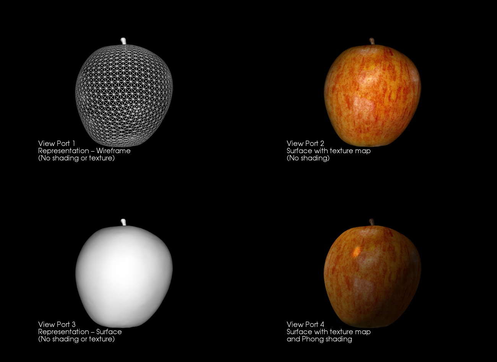

# Assignment 1 - README
##  MM 804 GRAPHICS AND ANIMATION
___

### About
Render 3d object using VTK in following representation
1) Wireframe
1) With texture
1) Surface
1) With textire and shading

Refer Assignment1.pdf for more details

### Output

### Requirements
Python - 3.6.7
VTK - 8.1.2

Object and texture files to be rendered.

### How to run
1) Open file assignment1.py and update lines 21, 22, 23 with the object file, texture file and output file location and names
2) Run the file using python3
