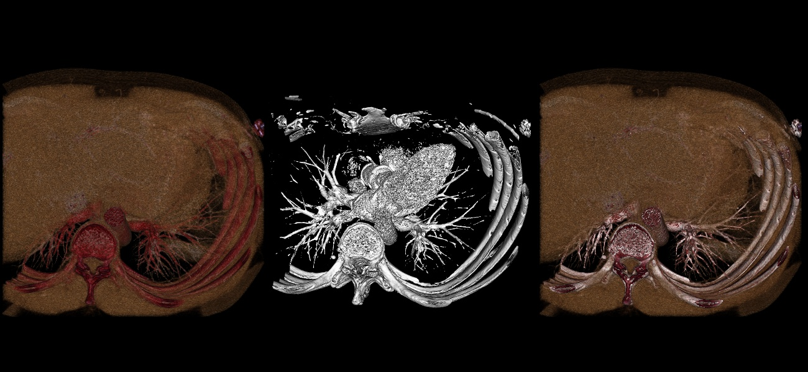

# Assignment 2 - README
##  MM 804 GRAPHICS AND ANIMATION
___

### Harsh Sharma
### 1546263

______

### About
Volume Rendering, Interaction and Histogram Computation

Objective - To display a Computed Tomography (CT) image using volume rendering as well as iso-surface representation.

Refer Assignment2.pdf for more details

### Output

### Development Environment

- Python - 3.6.7
- VTK - 8.1.2
- OS - Ubuntu 18.04.1 LTS
- Kernel - 4.15.0-45-generic

### How to run
1) Open file assignment2.py and
2) Run the file using python3

``python3 assignment2.py ``

