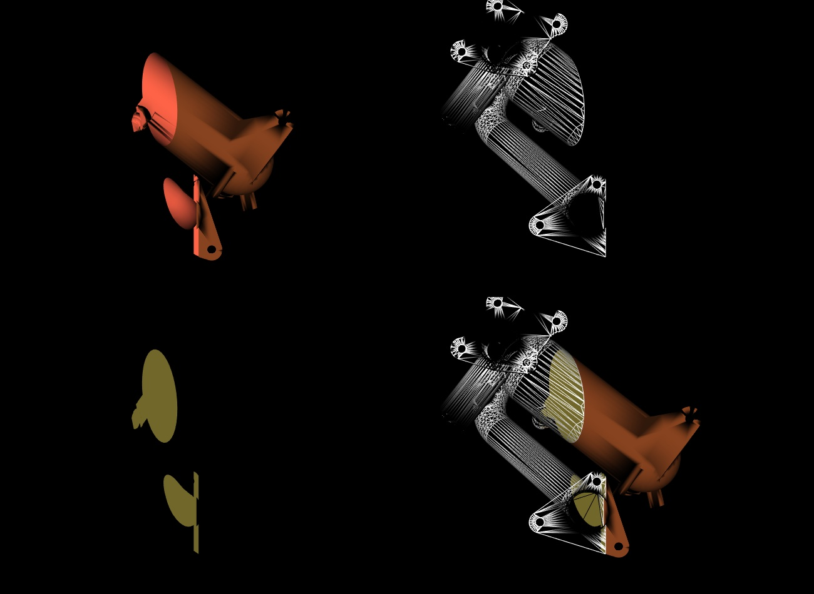

# Assignment 3 - README
##  MM 804 GRAPHICS AND ANIMATION

### Harsh Sharma (1546263)

______

### About

Implicit Functions and Cropping

Objective - to use a plane to clip a polygonal data, and display the clipped out and remaining parts of the data.

Refer Assignment3.pdf for more details

### Output

Output shown below and in file assignment3_sharma_harsh.jpg

### Development Environment

- Python - 3.6.7
- VTK - 8.1.2
- OS - Ubuntu 18.04.1 LTS
- Kernel - 4.15.0-45-generic

### How to run
1) Open file assignment3.py and
2) Run the file using python3

``python3 assignment3.py ``

